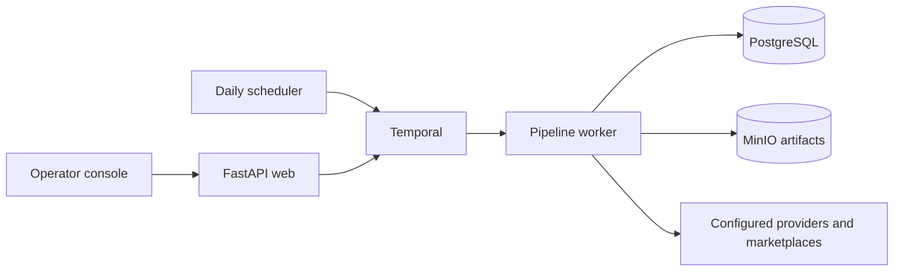

# MerchFlow — Durable AI Commerce Workflows

MerchFlow turns product research into print-ready artwork and verified Etsy listings through durable Temporal workflows. Built with Python, FastAPI, and PostgreSQL, it combines structured AI generation, deterministic and visual QA, marketplace integrations, and immutable artifact storage in an automated print-on-demand production system.

The engineering focus is recovery and correctness across external APIs: checkpoints preserve completed model calls, bounded revisions recover from artwork defects, uncertain publication requests require reconciliation before replay, and pixel comparisons verify the photos actually served by Etsy. Audit artifacts, Prometheus metrics, and optional OpenTelemetry tracing make the workflow inspectable.

Each daily workflow researches ten concepts, ranks them, creates and validates one product package, then publishes enabled channels independently through Printify. Manual release approval, IP screening and attestation, and the Etsy production-partner confirmation check can each be enabled when needed.

The safe default uses fake model/provider responses and `MERCH_PUBLISH_MODE=dry_run`. Scheduled and manual runs can complete automatically in dry-run mode. Live marketplace mutation requires an explicit `MERCH_PUBLISH_MODE=live` setting; QA, catalog, price, variant, and storefront verification still gate publication.

## How it works



The web process handles review and configuration. Temporal coordinates retries and schedules; the worker creates and validates packages, then publishes each enabled channel. PostgreSQL stores run state and MinIO stores versioned artwork. The default fake provider and dry-run publish modes exercise the workflow without live API calls.

## Quick start

Requirements: Docker with Compose v2. Copy the example configuration and start the stack:

```bash
cp .env.example .env
docker compose up --build
```

Open the operator console at <http://localhost:8000>, sign in with the local password `merch-dev`, and use **Start manual run**. Temporal UI is at <http://localhost:8080>; MinIO Console is at <http://localhost:9001>.

The example passwords and service ports are for local development. Compose binds published ports to `127.0.0.1`. Before exposing the stack beyond your machine, follow [Configuration and live setup](#configuration-and-live-setup) and [Reverse proxy, webhooks and backups](#reverse-proxy-webhooks-and-backups).

The startup migration creates the application schema. The scheduler runs both analytics and product development daily at **09:30 America/New_York**, and the worker executes both workflows. Set `MERCH_WORKFLOW_HOUR`, `MERCH_ANALYTICS_HOUR`, `MERCH_SCHEDULE_MINUTE`, and `MERCH_SCHEDULE_TIMEZONE` to adjust the schedule. Scheduled launchers create deterministic `merch-daily-YYYY-MM-DD` workflow IDs, so a daily run cannot be duplicated. Reconciliation preserves an existing pause.

For a fast host-only acceptance run with no services or external APIs, install Python 3.14 and [uv](https://docs.astral.sh/uv/), then run:

```bash
uv sync --extra dev --locked
uv run merch fixture
uv run merch fixture --approve
```

The fixture command stops at `awaiting_approval` so its package can be inspected. `--approve` explicitly exercises dry-run channel publication. Normal Temporal workflows release automatically when manual checks are disabled.

## What is implemented

- Strict Pydantic schemas for research, ten candidates, selection, creative/typography briefs, IP evidence, QA, listings, pricing, templates, approval, and normalized analytics.
- OpenAI Responses API structured parsing with Astra for selection, creative direction, and visual QA; Terra for research, typography, and listings. Web-search-enabled research and optional IP checks store prompts, response IDs, citations, usage, model and schema versions. Raster generation/editing uses `gpt-image-2.5-sunburst` without asking the model to render text.
- Exact slogan rendering through SVG/librsvg’s Pango/HarfBuzz stack and the container’s Noto Sans OFL font. Output is transparent sRGB PNG at exact catalog dimensions with 300-DPI metadata.
- Deterministic dimensions, alpha, size, text equality, padding, color contrast, dark-garment gradient and enlargement checks. Passing deterministic checks proceed to vision QA; failed checks go directly to a targeted revision, up to three total attempts.
- When enabled, IP screening uses denylisted brands/properties, web/marketplace evidence, USPTO search links and `ip_risk > 20` rejection. This is evidence, not legal clearance.
- Versioned immutable SHA-256 storage in MinIO/S3 or the local filesystem. Regeneration, copy edits, price edits, and post-approval cost changes invalidate approval.
- Printify V1 shop/catalog/upload/product/publish/read/order operations, safe-read retries, independent channel results, and ambiguous-create reconciliation by artwork/title fingerprint rather than blind replay.
- Read-only Shopify GraphQL Admin `2026-07`/ShopifyQL, Etsy Open API v3, and Amazon SP-API report clients. Etsy Stats CSV fills otherwise unavailable funnel fields. PII is not persisted.
- Argon2id operator login, signed secure sessions, CSRF protection, trusted-proxy handling and login throttling. Refreshable Etsy/Amazon OAuth values can be encrypted in PostgreSQL using the environment master key.
- Prometheus metrics, correlation-ID JSON logs and optional OTLP HTTP tracing for FastAPI and outbound HTTP calls.

## Configuration and live setup

Generate production values before setting `MERCH_APP_ENV=production`:

```bash
uv run merch hash-password
openssl rand -base64 48
openssl rand -base64 32
```

Use the first output as `MERCH_ADMIN_PASSWORD_HASH`, one random value as `MERCH_SESSION_SECRET`, and another as `MERCH_CREDENTIAL_ENCRYPTION_KEY`. Production validation refuses to start without all three. Keep provider credentials in your secret manager rather than committing `.env`.

Configure one active product template through `PUT /api/template` (the OpenAPI console is at `/docs`). It must contain the current Printify blueprint/provider, exact front-DTG print dimensions, enabled variant IDs, colors/sizes/current production costs, and one Printify shop ID and fee assumptions per enabled channel. Etsy production-partner confirmation is checked only when `MERCH_ETSY_PRODUCTION_PARTNER_CHECK_ENABLED=true`. Marketplace fees are deliberately not hard-coded. Prices are calculated as:

```text
next .99((production cost + fixed channel fee) / (1 - percentage fee - 0.40))
```

Shipping is buyer-paid and excluded. Listing metadata is generated only from this snapshot. Before publishing, the worker re-reads the catalog; availability/cost changes update the package version and send it back for approval.

For the Etsy-only Bella+Canvas 3001 / SwiftPOD setup, `docker compose exec -T web .venv/bin/python -m merch.setup_etsy_tee` verifies live catalog variant IDs and installs a versioned 14-color, XS-3XL (98-variant) template using the existing Etsy shop and fee assumptions. The base colors are Black, White, Navy, Asphalt, Dark Grey Heather, Athletic Heather, Natural, Military Green, Olive, Light Blue, Maroon, True Royal, Red, and Soft Pink. The selection prioritizes [Printify's top-selling colors](https://printify.com/blog/product-variants/) where this provider offers them, then adds familiar choices across light, dark, and accent colors. Swatch hex values approximate the garment colors for artwork QA; verify them against garment samples when color matching matters. Production costs were reviewed in Printify on 2026-09-16; recheck prices and stock before live publishing. Artwork QA checks every enabled shirt color, and removes colors that fail contrast for that product.

Set `MERCH_IP_CHECK_ENABLED=true` to run deterministic and web-search IP checks and show the IP evidence and attestation checkbox in the run UI. It defaults to `false`. The setting also controls whether IP risk affects candidate ranking. Restart the web and worker processes after changing it.

Manual checks are opt-in. `MERCH_MANUAL_APPROVAL_ENABLED=false`, `MERCH_ETSY_PRODUCTION_PARTNER_CHECK_ENABLED=false`, and `MERCH_IP_CHECK_ENABLED=false` are the defaults. When all three are off, a passing package automatically releases to its enabled channels; the release still checks the exact package version, current Printify catalog, QA, approved prices, and live storefront results. Set `MERCH_MANUAL_APPROVAL_ENABLED=true` to require channel selection and typing `PUBLISH` on the run page. Enabling either IP screening or the Etsy partner check also requires the human release step. These settings take effect after restarting the web and worker.

Set `MERCH_PROVIDER_MODE=live` to call OpenAI and validate Printify. Keep `MERCH_PUBLISH_MODE=dry_run` while validating credentials and previews. Only after that set `MERCH_PUBLISH_MODE=live`; enabled channels can then publish automatically after QA and validation. When manual checks are enabled, the workflow waits for their required review and confirmation.

### OpenAI cost controls

Research, typography, and listings default to `gpt-5.6-terra`; selection, creative direction, optional IP screening, and visual QA use `MERCH_OPENAI_TEXT_MODEL` (`gpt-6-astra` by default). Routine calls use medium reasoning; selection, creative direction, and optional IP screening use high reasoning. Visual QA sends images with `high` detail. Initial artwork uses medium image quality and revisions use high quality. Override these with the `MERCH_OPENAI_*` variables in `.env.example` when a specific stage needs more quality. The creative and listing prompts include only enabled colors, sizes, channels, and print dimensions instead of the full variant catalog.

Set `MERCH_FLAT_ARTWORK_CLEANUP_ENABLED=true` to flatten generated illustrations to the brief's exact color palette, make printed regions opaque, and remove tiny color debris before QA. Keep it off for artwork that intentionally uses gradients or translucent shading. Image edit requests preserve the source dimensions when the source uses a supported size.

Creative direction can automatically choose upward or downward arched lettering and restrained distress effects. Text distress uses the typography level `0–5`; `CreativeBrief.artwork_distress_level` applies distress once to the whole design, including illustration-only artwork, and takes precedence over text distress. The renderer protects narrow strokes and small details, records the requested and applied effects with each artwork artifact, and shows the actual effects on the run page and API. Readability or printability failures enter the bounded brief-rewrite recovery so a revised brief can simplify the effects. Featured-color selection uses the finished artwork. Existing saved artifacts stay authoritative and published designs are not regenerated.

Each run page and `GET /api/runs/{run_id}` show estimated OpenAI spend by stage from recorded usage. Unpriced calls are identified separately. Estimates use standard API rates and do not replace OpenAI billing. Research, selection, creative, source artwork, QA, listing drafts, and the listing polish pass are saved as they complete, so a Temporal activity retry normally resumes from the last completed stage instead of repeating earlier paid calls. A polish failure keeps a valid draft and records a warning. The listing prompt writes distinct Etsy, Shopify, and Amazon US copy with natural search phrases; Etsy title, tag, and disclosure limits are checked before approval. Only deterministic QA failures skip visual QA; visual judgment remains required before a passing package can reach approval.

Set a project spend alert and, if you need automatic cutoff, a hard project spend limit in the [OpenAI project Limits settings](https://help.openai.com/en/articles/9186755). Those account controls are managed in OpenAI, outside this app.

Connector failures degrade independently. Missing analytics remain null with completeness metadata, and stale analytics never blocks research. Publication does block for missing Printify/template data, failed QA, invalid release validation, and absent Etsy production-partner confirmation when that check is enabled.

### Etsy publishing and mockup verification

Choose the **Featured listing photo fallback** variant on the Connectors & catalog page and save the versioned product template. Each run previews the final QA-approved artwork on its available shirt colors, ranks those previews, and selects the best color's Printify mockup as the lead listing image. The catalog choice supplies the preferred size and breaks ranking ties; measured contrast decides when visual ranking is unavailable. The selected variant and preview are saved with the approved run. Live Etsy publication requires `MERCH_ETSY_API_KEY`, `MERCH_ETSY_SHARED_SECRET`, `MERCH_ETSY_SHOP_ID`, and an OAuth grant with `listings_r` and `listings_w` scopes. For unattended runs, store the grant's refresh token as `MERCH_ETSY_REFRESH_TOKEN` in `.env` or as an encrypted **Etsy refresh token** on the Connectors page; `MERCH_CREDENTIAL_ENCRYPTION_KEY` must be set. The app refreshes the access token before expiry and saves rotated tokens encrypted in the database. Etsy sales analytics also needs `transactions_r`. After Printify accepts a publish, the worker waits up to `MERCH_ETSY_NATIVE_PUBLISH_GRACE_SECONDS` (600 by default) for its Etsy listing ID, then verifies all approved variants, prices, selectors, and the featured image. If Printify finishes without a listing ID, the worker checks Etsy for an existing matching listing. When none exists and the Printify product is unlocked, it creates an Etsy draft with every approved variant, one mockup per shirt color, and color photo links. It activates and links the listing to Printify, then marks the run published only after readback from both systems. Ambiguous matches, missing credentials, or an unconfirmed link leave the run at `verification_required`. Etsy allows up to 20 photos.

Direct Etsy publication needs shop-specific taxonomy, shipping, return, processing, and production-partner IDs in the versioned product template. Import these once from a verified listing already published by this app: `docker compose exec -T web .venv/bin/merch import-etsy-defaults <listing-id>`. The command validates the listing and saves a new template version; application source contains no shop-specific IDs. A live test purchase is still needed to verify downstream order fulfillment.

Automatic Etsy publication verifies one front mockup for every approved shirt color. Before submitting a Printify publish or creating an Etsy draft, the worker matches the rendered variant and downloads the source photos; ambiguous colors or duplicate image content stop the run. Before activating a direct draft, and before completing any native, adopted, or resumed publication, it downloads Etsy's actual photos, compares their pixels with the expected sources while allowing resizing/JPEG compression, and verifies every color-photo link and the featured rank. Final reads check that the gallery, photo links, and inventory color IDs stayed consistent during verification. The app requires exactly one photo per approved color for Etsy listings; extra or missing photos require review. These gallery requirements do not apply to other sales channels.

Failed mockup checks produce `verification_required`, including when another channel succeeded. A direct draft stays unactivated if its preactivation checks fail. Listings already active when a mismatch is found remain available for operator review, including mismatches detected after activation. To resolve a flagged gallery:

1. Open **Publishing status → Mockup verification** on the run page and compare the saved **Expected photo** and **Etsy photo** for each color. A missing Etsy capture can mean verification stopped before downloading it.
2. Correct the reported source or Etsy gallery problem. Confirm one matching front photo per approved color, each color linked to its photo, and the approved featured color first.
3. Select **Retry verification**. The retry reuses saved product/listing IDs and checks the actual photos again; a saved photo ID or alt text alone cannot pass verification.

The **Raw audit package** contains source identities, hashes, comparison results, and immutable image references. It retains the last ten failed verification reports after retries. Evidence requires an authenticated operator session and remains subject to the artifact-storage backup policy.

For an Etsy listing completed before selector normalization was added, run `docker compose exec -T web .venv/bin/merch repair-etsy-listing <run-id>` after configuring the Etsy credentials. This checks the approved Printify product and live Etsy listing, repairs selector labels and variation photo links, and verifies prices, variants, and all color photos without republishing the product. It does not replace incorrect photo content; correct those photos before rerunning the command.

QA checks every enabled garment swatch. When a contrast **error** identifies specific shirt colors, the run checks alternate Bella+Canvas 3001 / SwiftPOD colors against the current Printify catalog, requires the full configured size range and print area, and runs contrast QA on each alternate swatch. It fills failed color slots with passing catalog colors, then runs visual QA on the proposed 14-color product. If visual QA rejects another color, the run repeats selection and visual QA with the remaining candidates. Other QA errors still block approval. The review page lists removed and replacement colors; the exact 14-color publication template is saved with the run for approval, pricing, and publishing. The shared base catalog remains unchanged. If fewer than 14 colors pass, the run pauses for a revised brief and nothing is published.

Useful commands:

```bash
uv run merch migrate
uv run merch web
uv run merch worker
uv run merch schedule
uv run merch run
uv run merch analytics
uv run merch connections
```

These last two are opt-in live smoke checks and are read-only. There is no live publish smoke command.

### Run recovery and publication retries

If a live run fails after research because API billing or a downstream provider is unavailable, restore access and resume its saved research with `docker compose exec -T web .venv/bin/merch resume-research <run-id>`. This is only allowed before any review artifact, approval, or publish attempt exists; when IP checks are enabled, previous screens are retained and rejected candidates are not re-screened. If the daily design schedule was paused for billing safety, unpause it explicitly with `docker compose exec -T temporal temporal schedule toggle --address temporal:7233 --schedule-id merch-daily-design --unpause --reason 'API billing restored'`. Schedule reconciliation preserves an existing pause.

When the same visual error appears in two consecutive revisions or QA exhausts artwork edits, the worker rewrites the creative brief and generates fresh artwork without repeating research or selection. Unsupported production requirements go directly to brief correction. Prompts share the raster, application-prepress, and catalog capabilities, and visual QA receives the complete deterministic results. Passing QA remains mandatory.

Recovery starts with targeted corrections. Recurring layout failures across two artwork versions, including separation-code aliases, or the third rewrite trigger persistent structural simplification: replace the composition and generation instructions, remove enclosing frames and optional decoration, and separate primary motifs. Theme, audience, design mode, and exact slogan remain fixed; the catalog controls garment colors. Append-only structural proposals are rejected. `MERCH_MAX_BRIEF_REWRITES` defaults to eight and includes rejected and interrupted attempts; each artwork version uses up to `MERCH_MAX_REVISION_ATTEMPTS` revisions, including the initial generation. Audit metadata records strategies, reasons, outcomes, and saved-version failures so activity retries preserve the budget and completed work. Exhaustion pauses at `awaiting_brief_revision` with a clear reason and failed QA artifacts. Edit the brief JSON on the run page or pass `--brief-file revised-brief.json` to `retry-artwork`; an unchanged brief is rejected. Provider failures can still be retried with `docker compose exec -T web .venv/bin/merch retry-artwork <run-id>` after the provider issue is fixed.

Publication retries retain product and draft IDs, accepted publish responses, and image-upload checkpoints. Requests with uncertain outcomes require reconciliation before another create or publish request. Etsy inventory uses both Size and Color as price dependencies when prices vary and no price dependency when prices are constant, preserving approved SKU prices. Etsy validation failures record the operation, HTTP status, and bounded sanitized messages. Successful publication still requires storefront readback.

## Operator API

Use **Copy refresh** in the operator console to review a one-time batch of existing mapped Etsy listings. The page compares current and proposed title, description, and tags, lets an admin edit each draft, and requires one approval of the exact batch version before live changes. The worker updates only these fields on the existing Printify products and Etsy listings, then checks identity, link, variants, prices, photos, and copy. Interrupted updates remain reviewable and resume against the same IDs. `docker compose exec -T web .venv/bin/merch prepare-copy-refresh` prepares or resumes drafts from the CLI without changing live copy. Shopify SEO fields are saved in new run packages; this flow does not update Shopify directly.

Authenticated JSON endpoints are available for run creation/list/detail, package editing, approval, rejection, cancellation, regeneration, per-channel retry, template management, encrypted connector-token storage, health checks, and Etsy CSV import. All state-changing session endpoints require the `X-CSRF-Token` header. Full request/response schemas are in `/docs`.

Saved mockup evidence is available at `GET /api/runs/{run_id}/mockup-evidence/{side}?color={color}`, where `side` is `source` or `actual` and the color is URL-encoded. The endpoint serves only the current report's stored PNG/JPEG bytes after checking their hash; missing evidence returns 404.

Temporal exposes `approve`, `reject`, `regenerate`, and `cancel` signals. Run state covers research, screening, ranking, generation, QA/listing, approval, publishing, partial/full success, rejection, cancellation, no-safe-candidate and failure.

The Printify webhook receiver is `/webhooks/printify`. Configure your public HTTPS URL and shared secret with the Printify webhook API, then set the same value in `MERCH_PRINTIFY_WEBHOOK_SECRET`; the reverse proxy must preserve the request body and `X-Pfy-Signature`. Persisted webhook payloads are recursively stripped of names, email, phone and address fields.

## Optional profiles

Prometheus/Grafana plus an OTLP collector:

```bash
# Add MERCH_OTEL_EXPORTER_ENDPOINT=http://otel-collector:4318 to .env first.
docker compose --profile observability up --build
```

NVIDIA Real-ESRGAN service:

```bash
# Add MERCH_REALESRGAN_ENDPOINT=http://realesrgan:8090 to .env first.
docker compose --profile nvidia up --build
```

The worker checks accelerator health before use. If unavailable, it uses Lanczos and records a QA warning when enlargement exceeds 1.5×.

## Reverse proxy, webhooks and backups

Terminate TLS in a reverse proxy, forward `Host`, `X-Forwarded-Proto` and `X-Forwarded-For`, and allow only that proxy’s address in `MERCH_TRUSTED_PROXY_IPS`. An example Caddy configuration is in `docker/caddy/Caddyfile`. Do not expose PostgreSQL, MinIO’s S3 port, or Temporal’s gRPC port publicly.

Back up both relational databases and the object store together. Example snapshot commands:

```bash
mkdir -p backups
docker compose exec -T postgres pg_dump -U postgres -Fc merch > backups/merch-$(date +%F).dump
docker compose exec -T postgres pg_dump -U postgres -Fc temporal > backups/temporal-$(date +%F).dump
docker run --rm --network merch-pod_default -v "$PWD/backups:/backup" quay.io/minio/mc \
  sh -c 'mc alias set pod http://minio:9000 minioadmin minioadmin && mc mirror pod/merch-artifacts /backup/artifacts'
```

The MinIO command uses the example local credentials; substitute your configured values before running it elsewhere. Keep backups outside Git and test restores regularly. Database rows reference immutable object keys; losing either side makes an audit package incomplete.

## Verification

```bash
uv run ruff check .
uv run mypy src
uv run pytest
MERCH_ENV_FILE=.env.example docker compose config --quiet
```

The default test run skips the opt-in Temporal and browser integration tests. Run those groups in separate pytest processes, matching CI:

```bash
RUN_TEMPORAL_TESTS=1 uv run pytest -m temporal
uv run playwright install chromium
RUN_PLAYWRIGHT=1 uv run pytest -m playwright
```

CI runs all three test groups with fake providers or mocked HTTP transports and does not call live marketplace APIs. Tests cover strict schemas, ranking/IP rules, pricing, typography equality, prepress/alpha/profile checks, hashing, encryption/redaction, metrics/CSV normalization, OpenAI and Printify contracts, automatic and manual release, CSRF and authentication. Recovery tests cover persistent rewrite budgets and interrupted publication checkpoints. Mockup tests cover rendered-variant selection, duplicate and swapped photo content, JPEG/resizing tolerance, changes during verification, resumed/adopted listings, cross-channel status, and authenticated evidence access.

Generated artwork, run reports, local databases, `.env` files, and backups are excluded from Git. Use `.env.example` as the configuration template. See [CONTRIBUTING.md](CONTRIBUTING.md) for development and pull request guidance and [SECURITY.md](SECURITY.md) for reporting vulnerabilities.

## Publishing and license

Create an empty GitHub repository, then connect and push this existing `main` branch:

```bash
git remote add origin <github-repository-url>
git push -u origin main
```

This project is released under the [MIT License](LICENSE). It permits use, modification, and redistribution, including commercial use, as long as the copyright and license notice are kept with copies of the software.

This system improves evidence-based product selection. It does not guarantee sales, virality, trademark clearance, marketplace acceptance, or legal compliance.
